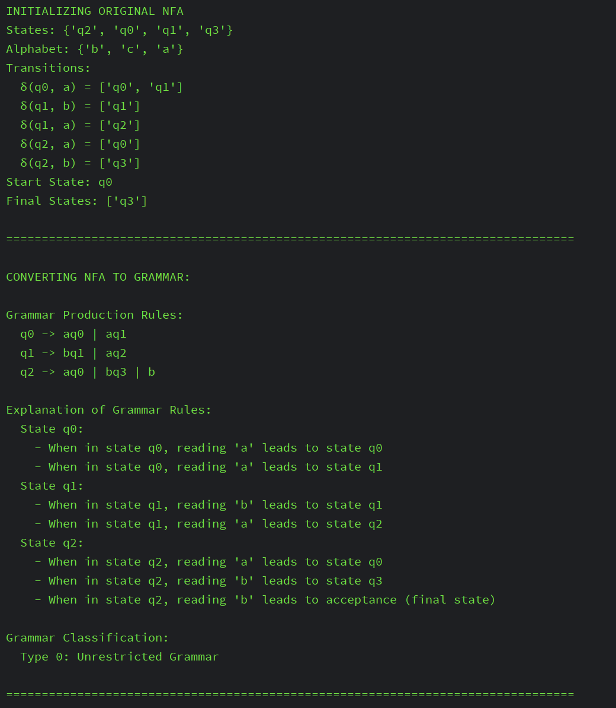
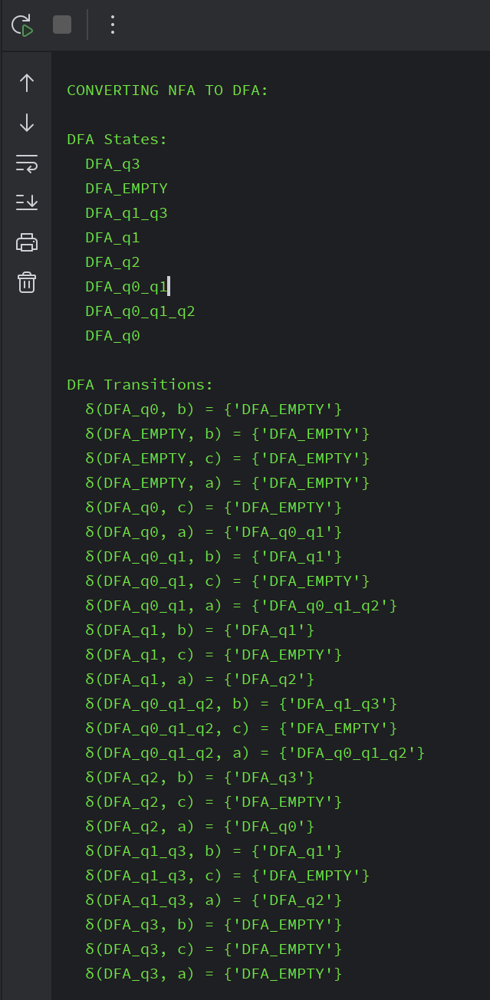
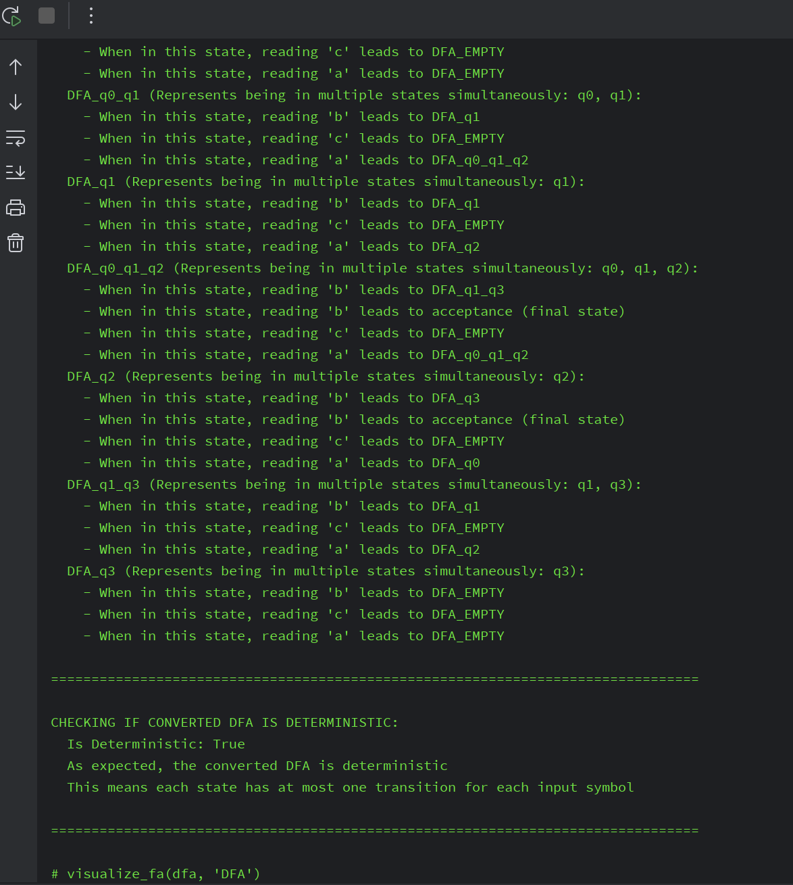
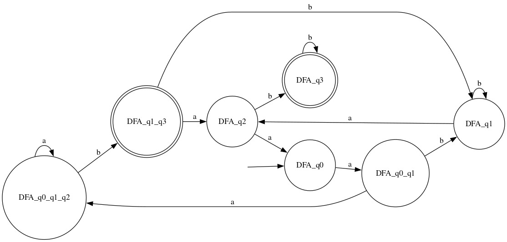

# Determinism in Finite Automata. Conversion from NDFA 2 DFA. Chomsky Hierarchy.

### Course: Formal Languages & Finite Automata
### Author: Ilico Artemie

----

## Theory
What is a Finite Automaton?
A Finite Automaton (FA) is a mathematical model used to represent and recognize patterns within input.

- States: A finite set of states, including one starting state and one or more accepting states.
- Alphabet: A finite set of symbols that the automaton can read (i.e., the input symbols).
- Transitions: A set of rules that describe how the automaton moves from one state to another upon reading an input symbol.
- Start State: The state where the automaton begins processing the input.
- Final States: A subset of the states that determine whether the automaton accepts the input string
- Finite automata are used in many applications, such as text processing, lexical analysis, and network protocol design.

There are two main types of finite automata:

## 1. Deterministic Finite Automaton (DFA)

A DFA is a type of finite automaton where, for each state, there is exactly one transition for each symbol in the alphabet. The machine operates deterministically, meaning that for any input, the next state is uniquely determined. This is the classical form of finite automaton, where each step is predictable.

### Properties:
- For each state and input symbol, there is exactly one transition.
- Can be represented as a directed graph where nodes are states and edges are transitions.

## 2. Nondeterministic Finite Automaton (NFA)

An NFA is a more flexible form of finite automaton. In an NFA, for each state and input symbol, there can be multiple possible next states (or none at all). The machine can move to any of these states, including the possibility of epsilon transitions (transitions without consuming any input).

### Properties:
- For each state and input symbol, there can be multiple transitions, or even none.
- Can have epsilon (ε) transitions, where the machine transitions between states without consuming any input symbol.
- While NFAs are more powerful in terms of their flexibility, they are equivalent in terms of the languages they can recognize to DFAs (every NFA can be converted to an equivalent DFA, though the DFA may have more states).

## Conversion from NFA to DFA

An NFA can be converted into an equivalent DFA using the subset construction. The key idea is to represent each set of states in the NFA as a single state in the DFA. The DFA's transitions are then derived from the possible combinations of NFA states.


## Objectives:

1. Discover what a language is and what it needs to have in order to be considered a formal one.
2. Provide the initial setup for the evolving project that you will work on during this semester. You can deal with each laboratory work as a separate task or project to demonstrate your understanding of the given themes, but you also can deal with labs as stages of making your own big solution, your own project. Do the following:
    - Create GitHub repository to deal with storing and updating your project;
    - Choose a programming language. Pick one that will be easiest for dealing with your tasks, you need to learn how to solve the problem itself, not everything around the problem (like setting up the project, launching it correctly and etc.);
    - Store reports separately in a way to make verification of your work simpler;
3. According to your variant number, get the grammar definition and do the following:
    - Implement a type/class for your grammar;
    - Add one function that would generate 5 valid strings from the language expressed by your given grammar;
    - Implement some functionality that would convert an object of type Grammar to one of type Finite Automaton;
    - For the Finite Automaton, please add a method that checks if an input string can be obtained via the state transition from it;


## Implementation description

This laboratory work focuses on the implementation and manipulation of Finite Automata (FA), including converting Non-deterministic Finite Automata (NFA) to Deterministic Finite Automata (DFA) and generating corresponding grammars. The laboratory uses three primary Python files:

- `main.py`: Contains the main execution flow and visualization
- `FiniteAutomata.py`: Implements the FA classes and operations
- `Grammar.py`: Implements grammar-related functionality

## Main Components

### Finite Automata Classes

The implementation finite automata:

```python
class FiniteAutomata:
    def __init__(self, **args):
        self.states = args.get("states")
        self.alphabet = args.get("alphabet")
        self.transitions = args.get("transitions")
        self.startState = args.get("startState")
        self.finalStates = args.get("finalStates")
```


### Key Methods

#### NFA to DFA Conversion

The method `NfaToDfa()` implements the conversion from NFA to DFA:

```python
def NfaToDfa(self):
    # Dictionary to store epsilon closures for each state
    epsilon_closure = {}
    for state in self.states:
        epsilon_closure[state] = self.getEpsilonClosure(state)
    
    # First state of DFA will be epsilon closure of start state of NFA
    start_state_set = epsilon_closure[self.startState]
    start_state_str = self._state_set_to_string(start_state_set)
    
    # Lists to track states to process and already processed states
    dfa_stack = [start_state_set]
    dfa_states = [start_state_set]
    dfa_states_str = {start_state_str}
    
    # Create output components for DFA
    dfa_transitions = {}
    dfa_final_states = set()
    
    
    # Create and return the DFA
    return FiniteAutomata2(
        states=dfa_states_final,
        alphabet=[a for a in self.alphabet if a != 'e'],  # Exclude epsilon
        transitions=dfa_transitions,
        startState=start_state_str,
        finalStates=dfa_final_states
    )
```

#### FA to Grammar Conversion

The method `finiteAutomatonToGrammar()` handles the conversion from FA to grammar:

```python
def finiteAutomatonToGrammar(self):
    Vn = self.alphabet
    Vt = self.states
    S = self.startState
    P = {}

    for key, values in self.transitions.items():
        for value in values:
            if key[0] not in P.keys():
                P[key[0]] = [key[1] + value]
            else:
                P[key[0]].append(key[1] + value)
            if value in self.finalStates:
                P[key[0]].append(key[1])

    return Grammar2(
        Vn=Vn,
        Vt=Vt,
        S=S,
        P=P,
    )
```

#### Grammar Classification

The method `chomskyTypization()` determines the grammar type based on the Chomsky hierarchy:

```python
def chomskyTypization(self):
    isType1 = True
    isType2 = True
    isType3Left = True
    isType3Right = True

    # Check for empty productions
    hasEmptyProduction = False
    for lhs, rules in self.P.items():
        for rule in rules:
            if rule == "":
                if lhs != self.S or hasEmptyProduction:
                    isType1 = False
                hasEmptyProduction = True

    # Check grammar rules
    for lhs, rules in self.P.items():
        if len(lhs) != 1 or lhs not in self.Vn:
            isType2 = isType3Right = isType3Left = False

        for rule in rules:
            # ... [rule checking logic] ...

    # Determine grammar type
    if isType3Right or isType3Left:
        return "Type 3: Regular Grammar"
    if isType2:
        return "Type 2: Context-Free Grammar"
    if isType1:
        return "Type 1: Context-Sensitive Grammar"
    return "Type 0: Unrestricted Grammar"
```

#### Deterministic Check

The method `isDetermenistic()` checks if an FA is deterministic:

```python
def isDetermenistic(self):
    for state in self.states:
        for symbol in self.alphabet:
            if isinstance(state, frozenset):
                if (state, symbol) not in self.transitions:
                    continue  # Missing transitions are allowed
                if len(self.transitions[(state, symbol)]) != 1:
                    return False
            else:
                if (state, symbol) not in self.transitions:
                    continue  # Missing transitions are allowed
                if len(self.transitions[(state, symbol)]) > 1:
                    return False
    return True
```

### Visualization Function

The `visualize_fa()` function uses the `graphviz` library to create graphical representations of finite automata:

```python
def visualize_fa(fa: FiniteAutomata2, title):
    graph = Digraph(comment=title)
    graph.attr(rankdir='LR')

    # Add states
    for state in fa.states:
        if state in fa.finalStates:
            graph.node(str(state), shape='doublecircle')
        else:
            graph.node(str(state), shape='circle')

    graph.node('start', shape='none', label='')
    graph.edge('start', str(fa.startState))

    # Add transitions
    for fromState, transitions in fa.transitions.items():
        for toStates in transitions:
            if isinstance(toStates, str):
                graph.edge(str(fromState[0]), str(toStates), label=fromState[1])
            else:
                for toState in toStates:
                    graph.edge(str(fromState[0]), str(toState), label=fromState[1])

    graph.render(f'{title}.gv', view=True)
```


## Conclusions / Screenshots / Results

- Here we can observe the output:











## References
[1] DSL_laboratory_works: Intro to formal languages. Regular grammars. Finite Automata. - Crețu Dumitru, Drumea Vasile, Cojuhari Irina - https://github.com/filpatterson/DSL_laboratory_works/blob/master/1_RegularGrammars/task.md
